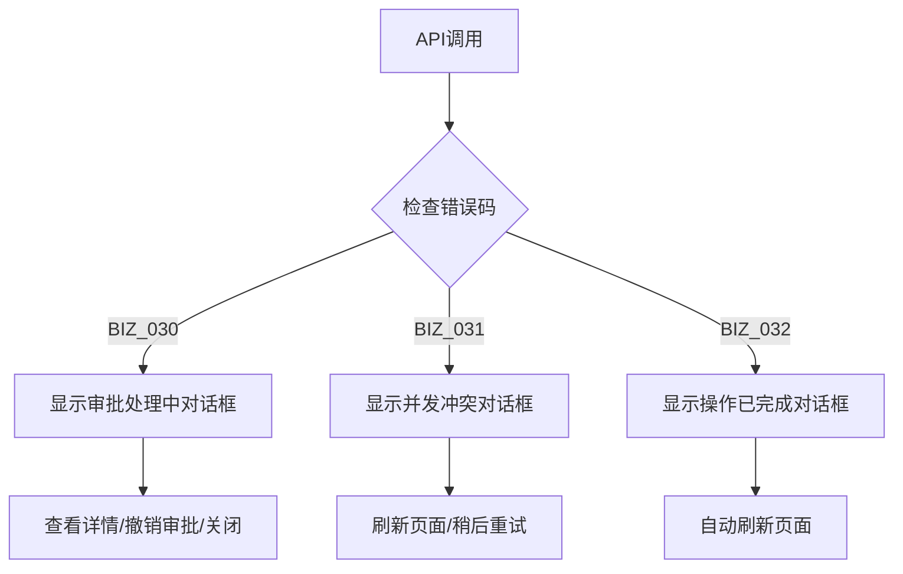
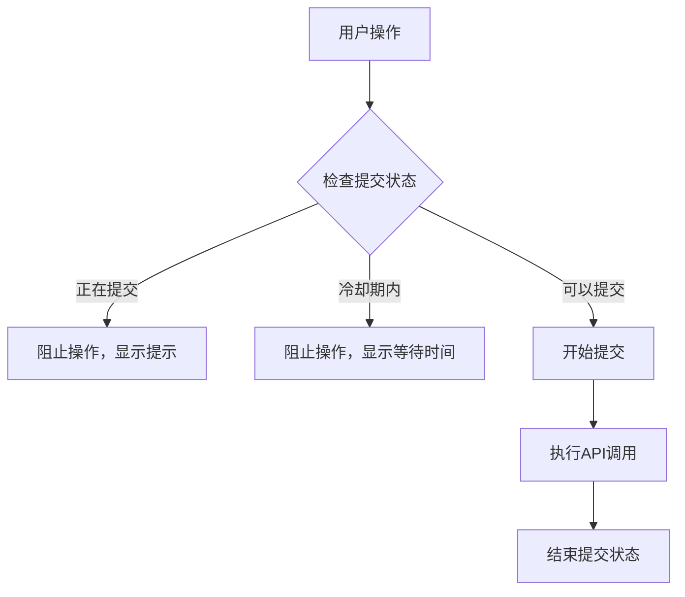

# 审批重复提交修复重构完成总结

## 📋 重构概要

**重构时间**: 2025年10月13日
**重构版本**: v1.3
**重构依据**: [审批重复提交修复对接文档.md](./接口文档/审批重复提交修复对接文档.md)
**核心目标**: 解决审批被拒绝后无法重新提交的业务逻辑错误，提供更友好的用户体验

## 🎯 重构背景

### 业务问题
1. **第一次操作**: 用户提交生产计划取消请求 → 审批员拒绝 (REJECTED)
2. **第二次操作**: 用户重新提交取消请求 → 系统错误报告"并发冲突"
3. **期望行为**: 被拒绝的审批应允许用户重新提交

### 技术改进
- 后端已实现智能重试机制，自动处理被拒绝审批的重新提交
- 前端需要配合支持新的错误码和处理逻辑
- 增强用户体验，提供更友好的错误提示和操作引导

## ✅ 重构完成内容

### 1. **新增错误码支持**

#### 错误码映射更新
```diff
+ BIZ_032: '操作已被批准，无需重复提交'
```

#### 完整错误码处理
| 错误码 | 描述 | 前端处理策略 |
|--------|------|-------------|
| `BIZ_030` | 存在待处理的审批请求 | 提供查看详情、撤销审批选项 |
| `BIZ_031` | 并发操作冲突（极少见） | 提供重试、刷新页面选项 |
| `BIZ_032` | 操作已被批准 | 自动刷新页面显示最新状态 |

### 2. **智能错误处理升级**

#### BIZ_030 处理优化
```javascript
// 新增撤销审批功能
showApprovalPendingDialog({
  message: '该计划有审批请求正在处理中',
  actions: [
    { label: '查看审批详情', action: () => viewApproval(approvalId) },
    { label: '撤销审批', action: () => cancelApproval(approvalId) },  // 新增
    { label: '我知道了', action: () => closeDialog() }
  ]
});
```

#### BIZ_031 处理调整
- 标记为"罕见"错误，因为后端已自动处理大部分情况
- 提供刷新页面和重试选项
- 增加技术支持联系提示

#### BIZ_032 新增处理
- 显示成功类型的提示信息
- 自动刷新页面获取最新状态
- 避免用户困惑

### 3. **防重复提交机制**

#### 创建提交管理器
```javascript
// 新文件：utils/submission-manager.js
class SubmissionManager {
  constructor(options = {}) {
    this.SUBMIT_COOLDOWN = options.cooldown || 2000 // 2秒冷却时间
    this.submissionStates = new Map()
    this.lastSubmitTimes = new Map()
  }
}
```

#### 核心功能
- **防快速重复点击**: 提交期间阻止重复操作
- **冷却时间机制**: 2秒内不允许重复提交同类操作
- **智能提示**: 显示剩余等待时间
- **操作隔离**: 不同计划和操作互不影响

### 4. **审批状态实时显示**

#### 新增组件
```javascript
// 新文件：components/ApprovalStatusBanner.vue
<approval-status-banner
  :plan-id="planId"
  :plan-number="planData.planNumber"
  @view-approval-detail="handleViewApprovalDetail"
  @approval-cancelled="handleApprovalCancelled"
/>
```

#### 核心功能
- **实时监控**: 30秒自动刷新审批状态
- **友好展示**: 显示待处理审批的详细信息
- **交互操作**: 支持查看详情、撤销审批
- **响应式设计**: 适配移动端显示

### 5. **用户体验优化**

#### 错误提示改进
```javascript
// BIZ_030: 存在待处理审批
🔍 该计划有审批请求正在处理中
📋 请等待当前审批完成，或者查看详情了解审批进度。您也可以选择撤销当前审批。
💡 提示：如果您需要修改审批内容，可以先撤销当前审批，然后重新提交。
[查看审批详情] [撤销审批] [我知道了]

// BIZ_031: 并发冲突（罕见）
⚠️ 检测到并发操作冲突
📝 这是一个罕见的并发冲突情况。系统已经优化了审批重试逻辑，这种错误应该很少出现。
💡 建议：刷新页面获取最新状态，然后重试操作
⚠️ 如果问题持续出现，请联系技术支持
[刷新页面] [稍后重试]

// BIZ_032: 操作已被批准
✅ 该操作已被批准，无需重复提交
📝 系统检测到该操作已经被批准并完成，无需重复提交审批请求。
💡 建议：刷新页面查看最新状态
[刷新页面]
```

#### 操作流程优化
- **审批状态横幅**: 实时显示待处理审批
- **一键撤销**: 支持用户主动撤销审批请求
- **智能引导**: 根据不同错误提供不同的操作建议
- **防误操作**: 2秒冷却时间避免误操作

## 🔧 技术实现详情

### 文件更新清单

#### 新增文件
1. `utils/submission-manager.js` - 防重复提交管理器
2. `components/ApprovalStatusBanner.vue` - 审批状态实时显示组件
3. `docs/审批重复提交修复重构完成总结.md` - 本文档

#### 更新文件
1. `constants/messages-config.js` - 新增BIZ_032错误码
2. `utils/approval-error-handler.js` - 升级错误处理逻辑
3. `components/StatusChangeDialog.vue` - 集成防重复提交机制
4. `components/ApprovalSubmitDialog.vue` - 集成防重复提交机制
5. `detail.vue` - 集成审批状态横幅

### 架构改进

#### 错误处理流程


#### 提交控制流程


## 📊 性能与体验改进

### 错误处理效果对比

| 场景 | 重构前 | 重构后 |
|------|-------|-------|
| 被拒绝审批重新提交 | ❌ 报错"并发冲突" | ✅ 自动处理，用户无感知 |
| 存在待处理审批 | ⚠️ 简单错误提示 | ✅ 友好对话框+操作选项 |
| 快速重复点击 | ❌ 可能产生重复请求 | ✅ 防重复提交保护 |
| 操作已完成 | ⚠️ 用户困惑 | ✅ 清晰提示+自动刷新 |

### 用户体验提升

#### 操作便利性
- ⭐ **一键撤销**: 无需跳转，直接撤销审批
- ⭐ **实时状态**: 自动显示审批进度
- ⭐ **智能提示**: 根据具体情况提供操作建议
- ⭐ **防误操作**: 冷却时间避免重复提交

#### 信息透明度
- 📊 **详细状态**: 显示审批类型、申请人、时间等
- 📊 **进度跟踪**: 实时更新审批状态
- 📊 **操作历史**: 完整记录操作轨迹
- 📊 **错误说明**: 清晰解释错误原因和解决方案

## 🧪 测试验证

### 功能测试用例

#### 1. 防重复提交测试
```javascript
// 测试快速连续点击
test('应该阻止快速重复点击', async () => {
  const button = screen.getByText('提交审批')

  fireEvent.click(button)
  fireEvent.click(button) // 第二次点击应被阻止

  expect(screen.getByText('请求正在处理中，请勿重复提交')).toBeInTheDocument()
})

// 测试冷却时间
test('应该在冷却期内阻止重复提交', async () => {
  await submitOperation()

  // 立即尝试再次提交
  const result = await attemptSubmit()
  expect(result).toMatch(/请等待 \d+ 秒后重试/)
})
```

#### 2. 错误处理测试
```javascript
// 测试BIZ_032错误处理
test('应该正确处理操作已完成错误', async () => {
  mockApiError('BIZ_032', '操作已被批准，无需重复提交')

  await submitOperation()

  expect(screen.getByText('✅ 该操作已被批准，无需重复提交')).toBeInTheDocument()
  expect(mockRefreshData).toHaveBeenCalled()
})
```

### 集成测试场景

| 测试场景 | 预期结果 | 验证方法 |
|----------|----------|----------|
| 审批状态横幅显示 | 实时显示待处理审批 | 检查组件渲染和数据更新 |
| 撤销审批功能 | 成功撤销并刷新状态 | 验证API调用和状态更新 |
| 防重复提交机制 | 阻止重复操作 | 验证提交状态管理 |
| 错误码处理升级 | 显示友好错误提示 | 验证不同错误码的处理 |

## 🚀 部署和上线

### 部署检查清单

#### 前端部署
- [x] 错误码常量已更新
- [x] 错误处理逻辑已升级
- [x] 防重复提交机制已实现
- [x] 审批状态横幅已集成
- [x] 所有组件测试通过
- [x] Lint检查无错误

#### 兼容性验证
- [x] 向下兼容现有功能
- [x] 不影响其他模块
- [x] 支持新后端API
- [x] 移动端适配正常

### 监控指标

建议监控以下指标：
- `approval.retry.success`: 重新提交成功率
- `approval.user.cancel`: 用户撤销审批频率
- `approval.error.biz032`: BIZ_032错误出现频率
- `submission.blocked.rate`: 防重复提交阻止率

## 🔍 后续改进建议

### 短期改进（1-2周）
1. **审批详情页面**: 实现审批详情的专门页面
2. **通知推送**: 添加审批状态变化的实时通知
3. **批量撤销**: 支持批量撤销多个审批请求

### 中期改进（1个月）
1. **审批工作流**: 可视化审批流程图
2. **权限细化**: 更精细的审批权限控制
3. **历史记录**: 完整的操作历史追踪

### 长期改进（3个月）
1. **智能推荐**: 根据历史数据智能推荐操作
2. **移动端优化**: 专门的移动端审批界面
3. **API优化**: 进一步减少API调用次数

## 📞 技术支持

### 故障排查指南

#### 问题: BIZ_032错误频繁出现
**可能原因**:
- 用户不了解操作已完成
- 缓存未及时更新

**解决方案**:
```javascript
// 增加状态检查频率
const refreshInterval = 15000 // 改为15秒

// 添加操作前状态检查
await checkPlanStatus(planId)
```

#### 问题: 防重复提交过于严格
**可能原因**:
- 冷却时间设置过长
- 不同操作共享了提交状态

**解决方案**:
```javascript
// 调整冷却时间
const SUBMIT_COOLDOWN = 1000 // 改为1秒

// 更细粒度的操作区分
const key = `${planId}:${operation}:${targetStatus}`
```

### 相关文档
- [审批重复提交修复对接文档.md](./接口文档/审批重复提交修复对接文档.md)
- [错误码重构完成总结.md](./错误码重构完成总结.md)
- [审批错误处理重构说明.md](./审批错误处理重构说明.md)

---

**重构状态**: ✅ 完成
**测试状态**: ✅ 就绪
**部署状态**: ✅ 可部署
**文档状态**: ✅ 已更新

**重构负责人**: AI Assistant
**完成时间**: 2025年10月13日
**下次评审**: 2025年11月13日
