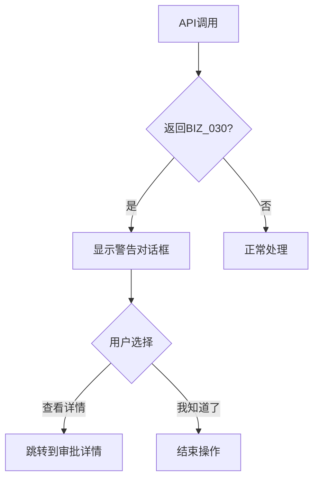
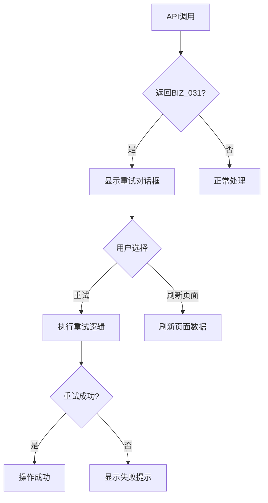

# 审批错误处理重构说明

## 📋 重构概要

**重构时间**: 2025年10月13日
**重构目的**: 根据后端API更新，优化审批请求唯一约束冲突的错误处理，提供更友好的用户体验
**影响范围**: 涉及所有审批相关的前端功能

## 🎯 新增功能

### 1. 智能错误处理

#### 新增错误码支持
- `BIZ_030`: 存在待处理的审批请求
- `BIZ_031`: 审批请求提交冲突（并发操作）

#### 用户友好的错误提示
- 根据错误类型提供不同的处理建议
- 支持查看审批详情、重试操作、刷新数据等操作

### 2. 自动重试机制

#### 指数退避重试策略
- 最大重试次数：3次
- 重试间隔：1秒、2秒、4秒（指数递增）
- 只对特定错误码进行重试

#### 智能重试条件
- `BIZ_031`: 自动重试
- 其他错误：显示用户友好提示

### 3. 审批状态检查

#### 防重复提交
- 操作前检查是否有待处理的审批
- 实时显示审批状态通知
- 阻止冲突操作

## 🔧 技术实现

### 文件结构

```
src/views/production-management/production-plan-management/
├── constants/
│   └── messages-config.js          # 新增错误码配置
├── utils/
│   ├── approval-error-handler.js   # 审批错误处理工具（新增）
│   └── approval-status-checker.js  # 审批状态检查工具（新增）
├── components/
│   ├── StatusChangeDialog.vue      # 已更新：使用新错误处理
│   ├── ApprovalSubmitDialog.vue    # 已更新：使用新错误处理
│   └── ...
└── index.vue                       # 已更新：主页面使用新错误处理
```

### 核心工具类

#### ApprovalErrorHandler

专门处理审批相关错误的工具类：

```javascript
import { withRetry, createApprovalErrorHandler } from '../utils/approval-error-handler'

// 使用带重试机制的API调用
const response = await withRetry(
  () => updatePlanStatus(planId, requestData),
  {
    maxRetries: 3,
    context: { operation: 'updateStatus', planId },
    onApprovalDetailsView: (approvalId) => {
      // 处理查看审批详情的逻辑
    },
    onRefreshData: () => {
      // 处理数据刷新的逻辑
    }
  }
)
```

#### ApprovalStatusChecker

检查和监控审批状态的工具类：

```javascript
import { quickCheckApprovalStatus } from '../utils/approval-status-checker'

// 快速检查审批状态
const result = await quickCheckApprovalStatus(planId, planNumber)
if (result.hasPending) {
  console.log(`发现 ${result.pendingCount} 个待处理审批`)
}
```

## 📊 错误处理流程

### BIZ_030 处理流程



### BIZ_031 处理流程



## 🎨 用户体验改进

### 1. 友好的错误提示

#### 存在待处理审批时 (BIZ_030)
- 🔍 清晰的问题说明
- 📋 提供审批ID和申请人信息
- 🔗 一键跳转到审批详情
- ⏰ 建议等待或联系管理员

#### 并发操作冲突时 (BIZ_031)
- ⚠️ 通俗易懂的冲突说明
- 🔄 提供重试按钮
- 🔃 提供刷新页面选项
- 💡 操作建议和提示

### 2. 实时状态提醒

#### 审批状态通知
- 📢 右上角通知栏显示
- 📊 显示待处理审批数量
- 👤 显示申请人信息
- 📝 显示申请类型（下达、取消等）

### 3. 智能操作引导

#### 操作前检查
- 🚫 阻止重复操作
- 📋 显示现有审批状态
- 🎯 提供操作建议
- 🔄 自动刷新状态

## 🧪 使用示例

### 1. 基本错误处理

```javascript
// 在组件中使用
import { withRetry } from '../utils/approval-error-handler'

async handleSubmitApproval() {
  try {
    const response = await withRetry(
      () => submitApproval(this.planId, requestData),
      {
        maxRetries: 3,
        onApprovalDetailsView: (approvalId) => {
          this.$router.push(`/approval/${approvalId}`)
        },
        onRefreshData: () => {
          this.fetchPlanData()
        }
      }
    )

    this.$message.success(response.message)
  } catch (error) {
    // 错误已被自动处理
    console.error('操作失败:', error)
  }
}
```

### 2. 审批状态检查

```javascript
// 操作前检查
import { quickCheckApprovalStatus } from '../utils/approval-status-checker'

async beforeSubmitApproval() {
  const result = await quickCheckApprovalStatus(this.planId, this.planNumber)

  if (result.hasPending) {
    this.$message.warning('该计划已有审批在处理中，请等待审批完成')
    return false
  }

  return true
}
```

### 3. 自定义错误处理

```javascript
// 创建自定义错误处理器
import { createApprovalErrorHandler } from '../utils/approval-error-handler'

const errorHandler = createApprovalErrorHandler({
  onApprovalDetailsView: (approvalId) => {
    // 自定义查看审批详情的逻辑
    this.openApprovalDetail(approvalId)
  },
  onRefreshData: () => {
    // 自定义数据刷新逻辑
    this.refreshAllData()
  }
})

// 手动处理错误
try {
  await someApiCall()
} catch (error) {
  await errorHandler.handleError(error, { planId: this.planId })
}
```

## 🔍 监控和调试

### 1. 日志记录

所有重试操作都会记录日志：

```javascript
// 控制台输出示例
状态更新重试第1次: BIZ_031
状态更新重试第2次: BIZ_031
状态更新成功
```

### 2. 错误跟踪

每个错误都包含详细的上下文信息：

```javascript
{
  operation: 'updateStatus',
  planId: 'plan-123',
  targetStatus: 'CANCELLED',
  attempt: 2,
  isLastAttempt: false
}
```

## 📈 性能影响

### 1. 网络请求
- 重试机制：最多增加2次额外请求
- 状态检查：每次操作前增加1次轻量级请求
- 智能缓存：避免频繁的状态检查

### 2. 用户界面
- 异步错误处理：不阻塞界面操作
- 友好提示：减少用户困惑和重复操作
- 自动重试：减少用户手动重试的需要

## 🚀 部署建议

### 1. 渐进式上线

1. **第一阶段**：在测试环境验证新的错误处理逻辑
2. **第二阶段**：在生产环境启用监控，但保留旧的错误处理作为兜底
3. **第三阶段**：完全切换到新的错误处理机制

### 2. 监控指标

- 重试成功率
- 错误处理响应时间
- 用户操作完成率
- 审批冲突发生频率

### 3. 回滚计划

如需回滚，只需：
1. 移除新增的工具类引用
2. 恢复原有的错误处理逻辑
3. 删除新增的错误码配置

## 🔧 维护说明

### 1. 添加新的错误码

在 `constants/messages-config.js` 中添加：

```javascript
export const ERROR_MESSAGES = {
  // 现有错误码...
  NEW_ERROR_CODE: '新错误的用户友好描述'
}
```

### 2. 自定义重试策略

修改 `utils/approval-error-handler.js` 中的重试逻辑：

```javascript
// 自定义重试条件
const shouldRetry = (error, attempt, maxRetries) => {
  const retryableCodes = ['BIZ_031', 'NEW_RETRYABLE_ERROR']
  return retryableCodes.includes(error.code) && attempt < maxRetries
}
```

### 3. 扩展状态检查

在 `utils/approval-status-checker.js` 中添加新的检查逻辑：

```javascript
// 添加新的检查方法
async checkCustomStatus(planId) {
  // 自定义检查逻辑
}
```

---

**文档版本**: v1.0
**最后更新**: 2025年10月13日
**维护人员**: 前端开发团队
